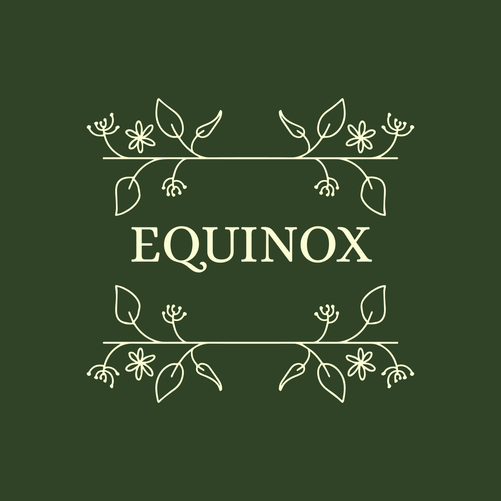

# **Equinox**

## Project Descripton

 
 *Welcome to Equinox, Where Cocktails Align With the Seasons​*

*At Equinox, we believe that every cocktail is an experience—one shaped by time, place, and the rhythm of nature. Inspired by the changing seasons, our recipes and curated selections are crafted to reflect the flavours, moods, and ingredients of the moment.*

Equinox is the latest cocktail bar to open in the city centre of Newcastle Upon Tyne. They are preparing to launch their website to showcase their seasonal drinks menu, advertise what the latest events are and how to attend, as well as provide information on who they are and what the bar is all about. 

## UX

### Project Goals

The primary goal of the Equinox website is to provide an attractive and easy to use website to inform and attract new customers in the area, allowing them to explore the menu, events and the ambience of the bar.  

#### User Goals 
The target auidence for the website are 18+ locals who are cocktail enthusiasts.

* Easy to use navigation and clear layout.
* Attractive images throughout the website.
* All content clear and visible on the page, easy to see and understand.
* Option to view drinks menu.
* To see what the bar and drinks look like. 
* Social media links to keep up to date with latest content.

#### Business Goals

* To inform potential customers of the available drinks on the menu.
* To provide clear ways to contact and follow the bar's social media to increase social media engagement. ​
* Show attractive images/videos of the drinks and bar to attract more customers. ​
* What's on section to showcase latest offers, drink specials and events​.
* Inform where they are located to increase foot traffic. ​

#### Developer Goals
* A professional looking static website that has a clear and consistent layout and styling on every page to be created with HTML and CSS throughout. The website will be fully responsive to create a better user experience on all devices. 
### User Stories

**User Story 1**

As a local to Newcastle upon Tyne I want to visit the latest bars in the area, before visiting I would like to have the option to check the drinks menu before I visit, to check if the drinks look and sound good. 

**Acceptance Criteria:**
* The website has a seperate page to view the drinks menu.
* The menu will show a description of the drinks, including ingredients and price.
* The menu will have high quality images of cocktails.

**Task:**
* Create an additional HTML page for the drinks menu.
* Add the content to each section of the new page, summer, winter, spring and autumn drinks.
* Add a link to the page on the navigation bar on the homepage.
* Pair each section with the correlating image.

**User Story 2**

As a potential customer I like to visit local events, I want to check what each event includes as well as view pictures of the event to check if it is something I would be interested in. 

**Acceptance Criteria:**
* Each event is listed on a seperate what's on page.
* The events will have a detailed description of what each event will be.
* Each event has an image linked to the specific event.

**Tasks:**
* Create a seperate HTML page for events.
* Add a link to the page in the navigation bar located on the homepage. 
* Add a detailed description of what the event will include. 
* Add an image to each event. 

**User Story 3**

As a frequent vistor to the area I like to check what date and time events are scheduled for so I can plan my visit in advance. 

**Acceptance Criteria:**
* Each event listing includes the date and time for each individual event.
* Events up to a month in advance are included on the events page.
* The what's on page will be organised with the event happening first at the top of the page.

**Task:**
* The description for each event includes the date and time.
* Add the events in order of the closest date first.
* Add events that are scheduled a month in advance.  

**User Story 4**

As a local to the area I like to register for upcoming events so I can add it to my calender and book my place in advance. 

**Acceptance Criteria:**
* Each event has a sign up form underneath the events.
* The signup form includes a name, email and number field and a field to add which event they are interested in. 
* How to register for events is included in the text before the events section. 

**Task:**
* Create a HTML signup form. 
* Add a placeholder for event field asking customer to add which event they are interested in. 
* Add details of how to register for events at the top of the page before events section, give an option to call to register interest or use the sign up form to make the process more accessible. 

**User Story 5**

As a person who frequently visits the bars of Newcastle, I like to view the images of the bar and gain an understanding of what the bar is about before I decide to visit. 

**Acceptance Criteria:**
* The homepage will have a large image visable as soon as you enter the website.
* There will be details and information of the theme of the bar on the homepage.
* Additional images will show how the inside of the bar looks.

**Task:**
* Add a hero image on the homepage, the image will be high quality and grab the attention of users. 
* Add a detailed but brief description of the bar to capture the theme and to entice the user to visit. 
* Add aditional images throughout the homepage paired with the text. 

### Design Choices 
The overall website is designed to capture the ambience of the bar. A clean look with neutral and green colours to keep within the theme of the bar, nature and the seasons. All design choices have been made with this in mind. 

#### Fonts 
* The primary font is **Alice**, this has been chosen due to it's eclectic, quaint style and soft rounded features that will add visual interest to the page while remaining readable. This is also the font used in the brand logo, so this will keep the look of the wesbite consistent. 
* The secondary font will be **Lora**. This was chosen because Lora works well with Alice for font pairing because they have similar letterforms.

#### Colours 
* The primary colour choices are **#304326**, a dark green, and **#FBFDD4**, a light cream colour. These were chosen for the logo and buttons as they compliment eachother well and the contrast between the colours makes the content easy to read and visually interesting. 
* Other colours used throughout the website were chosen to compliment the primary colours and to match the images chosen. 

#### Background & Images
* The primary background colour for the homepage will be **#304326** (dark green). The colour **#FBFDD4** (light cream) will be used for the background against text to create contrast from the dark green, both colours compliment all of the images selected for this page. 
* The hero image on the home page has been chosen to create a positive emotion as soon as the user enters the website and to entice the user to explore the site further. It shows a preview of what the drinks look like. The image contains greenery in the background of the drinks which match the background colours and the theme of the bar. 
* All images were chosen as they are high quality and consistent in style. They clearly show the variety of drinks on offer. Images were sourced from Unsplash, a website providing free to use images. 

#### Styling

* The corners of the boxes containing text content have been kept sharp and not rounded to give those sections a professional look, this creates a visual contrast between the font (which has soft rounded edges) and it's container.  This is repeated throughout the website on all pages so that the website feels and looks cohesive.

* The images on the drinks menu will be circular, this is to create a slight difference between the menu images and the images on the other pages. The styling of the images will be more visually appealing while also saving space on the page as the menu will have more text. 

* All buttons will have sharp corners to once again give a professional look and to highlight the importance of the button. 

#### Wireframes

The wireframes have been made using [Balsamiq](https://balsamiq.com/ "link to balsamiq"). 
